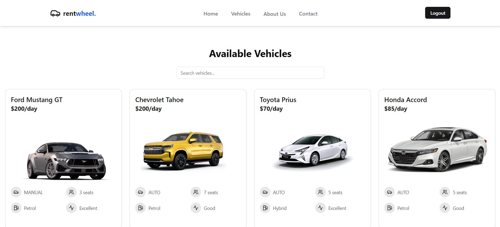
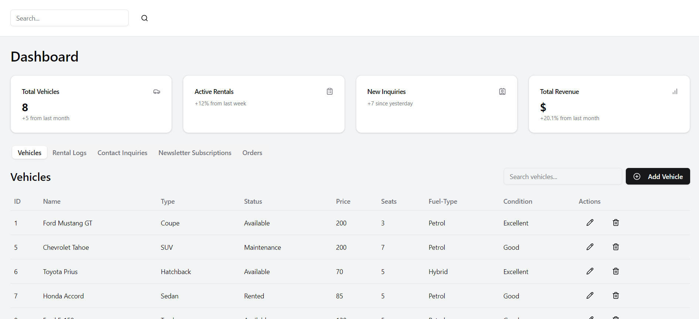

# Car Rental Website


## Project Overview

This Car Rental website is a full-stack application built as a team project. The platform allows users to browse available vehicles, create bookings, and manage their reservations. The frontend is developed using React, while the backend is powered by Node.js and Express, with PostgreSQL as the database hosted on Neon DB.

## Table of Contents
- [Features](#features)
- [Tech Stack](#tech-stack)
- [Installation](#installation)
- [Usage](#usage)
- [Contributors](#contributors)
- [License](#license)

## Features
- **User Authentication**: Secure login and registration for users.
- **Vehicle Listings**: Browse available cars with details like name, price, and specifications.
- **Booking Management**: Users can book vehicles, view their bookings, and manage reservations.
- **Search Functionality**: Users can search for vehicles by name and filter results based on criteria.
- **Responsive Design**: Optimized for both desktop and mobile devices.

## Tech Stack
- **Frontend**: 
  - React
  - React Router
  - Tailwind CSS for styling
  - Axios for HTTP requests
  - React Hot Toast for notifications
  - SCHADCN UI for reusable UI components
- **Backend**: 
  - Node.js
  - Express.js
  - JWT for authentication
  - Prisma for ORM
- **Database**: 
  - PostgreSQL hosted on Neon DB

## Installation

 **Clone the repository**:
   ```bash
   git clone https://github.com/yourusername/car-rental-website.git
   cd car-rental-website
   ```

### Setup the backend:
```
cd backend
npm install
```
### Setup the frontend:
```
cd ../frontend
npm install
```
### Run the backend:
```
cd backend
npm run dev
```
### Run the frontend:
```
cd frontend
npm start
```

# DEMO
## user

## admin
